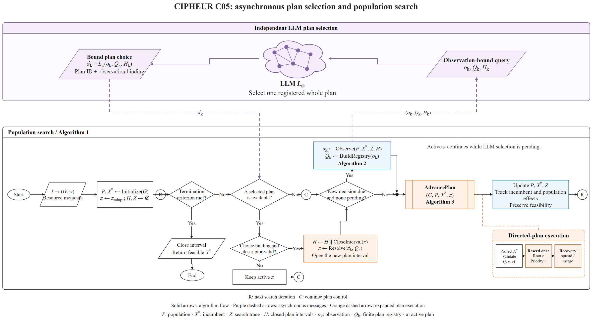

# AAMAS · CIPHEUR C05

This is the **non-llm-controls** branch. See [selector definitions and commands](docs/CONTROLS.md).

[中文说明](README.zh-CN.md) · [Problem model and notation](docs/MODEL_AND_PSEUDOCODE.md) · [LaTeX pseudocode](docs/c05_model_algorithm.tex) · [PDF](docs/c05_model_algorithm.pdf) · [Algorithm details](docs/ALGORITHM.md) · [Results and protocol](docs/RESULTS.md)

C05 is the finite structural-plan controller from CIPHEUR v0.6.0. It combines a persistent four-solution native maximum-weight independent-set search with an asynchronous LLM that selects an exact plan from the current observation-bound registry. The graph objective is total contact duration, stored as integer ticks.

## Repository branches

| Branch | Contents |
|---|---|
| [`main`](https://github.com/Mister-Ryder/AAMAS-CIPHEUR-C05/tree/main) | C05 LLM entry point, native search engine, eight input graphs, LLM run records, numerical summaries, algorithm documentation and figures |
| [`non-llm-controls`](https://github.com/Mister-Ryder/AAMAS-CIPHEUR-C05/tree/non-llm-controls) | Everything in main, plus KNN, LinUCB, bandit, rule, static and the registered adaptive baseline mode, with their detailed results |

The main branch retains the shared feature construction and interval-update bookkeeping used by the LLM execution path. Classical plan selection is enabled on `non-llm-controls`.

## Algorithm



[Editable draw.io](docs/figures/c05-flowchart.drawio) · [PDF](docs/figures/c05-flowchart.drawio.pdf) · [SVG](docs/figures/c05-flowchart.drawio.svg) · [Chinese figure](docs/figures/c05-flowchart-zh.drawio.pdf)

1. Initialize four feasible search trajectories and protect the incumbent.
2. Observe objective gains, stagnation, trajectory overlap, resource/time metadata, target-specific conflict witnesses and completed plan intervals.
3. Freeze a registry containing nine single-operation plans and eligible directed plans. A directed plan binds a replaceable slot, an observed anchor contact, a priority template and a recovery operation.
4. Send a detached observation to the LLM. The native search keeps running during the request. The response contains `snapshot_id`, an exact `plan_id`, `hypothesis` and `evidence`.
5. Validate the selected plan and recheck protected slots before native entry. A directed plan reseeds its target trajectory once, continues search, then applies spread or merge for recovery. The last search operation persists until the next installation.
6. Record incumbent and population gains over each closed installed interval, return this history to subsequent decisions, and return the final feasible incumbent at the deadline.

The detailed [algorithm specification](docs/ALGORITHM.md) maps these components to their implementation, response schema, priority templates, timing and execution rules.

## Recorded experiment

CP-SCALE-AU-L002; eight constraint views; seeds `67, 71, 73, 79, 83`; 360 seconds per run; population 4; one native thread per run. The historical batch used 16 independent workers. Each selector has 40 runs.

The reported mean is the arithmetic mean of five seeds within each view, followed by an equal-weight mean over the eight views. `contact_seconds = value_ticks / 1,000,000`.

| Selector | Mean contact-seconds | Detailed records |
|---|---:|---|
| LLM — DeepSeek Flash | 1,137,361.735189 | main |
| KNN | 1,137,632.198938 | non-llm-controls |
| LinUCB | 1,137,512.893283 | non-llm-controls |
| Bandit | 1,137,219.802194 | non-llm-controls |
| Rule | 1,137,174.044553 | non-llm-controls |
| Static | 1,137,128.217217 | non-llm-controls |
| Adaptive | 1,133,859.369542 | non-llm-controls |

See [results](docs/RESULTS.md) for per-view values, runtime fields, input hashes, source receipts and the aggregation procedure.

## Build and run

Use Linux or WSL with Python 3.10+, GCC/G++, and OpenMP. Run from this checkout; the native build is loaded from its `build/` directory.

```bash
git clone https://github.com/Mister-Ryder/AAMAS-CIPHEUR-C05.git
cd AAMAS-CIPHEUR-C05
python -m pip install -e .
python scripts/build_native.py
```

Set `CIPHEUR_API_KEY` in your environment. The provider defaults are `CIPHEUR_ENDPOINT=https://api.deepseek.com/chat/completions` and `CIPHEUR_MODEL=deepseek-flash`. The recorded profile uses thinking enabled, reasoning effort `low`, and a maximum of 8,192 output tokens.

```bash
python -m cipheur_c05 data/CP-SCALE-AU-L002/g0340.npz \
  --out run_outputs/g0340_llm_seed67.json --seed 67 --seconds 360 \
  --graph-id CP-SCALE-AU-L002__g0340
```

The output path must be new. The CLI sets one numerical thread per process. The first request opportunity is after 20 seconds; subsequent opportunities are 40 seconds apart. Submission requires an idle request worker and more than 47 seconds remaining. The profile allows at most eight calls, a 45-second HTTP timeout and a 60-second response lifetime.

An offline fixture exercises the build and LLM installation path without HTTP requests:

```bash
python scripts/smoke_check.py
```

For the other selectors, switch to `non-llm-controls` and use its [CLI and selector instructions](https://github.com/Mister-Ryder/AAMAS-CIPHEUR-C05/blob/non-llm-controls/docs/CONTROLS.md). The original eight NPZ graphs are included under [`data/CP-SCALE-AU-L002`](data/CP-SCALE-AU-L002); their hashes are listed with the experiment records.

## Source layout

| Path | Role |
|---|---|
| `cipheur_c05/` | Release command-line entry point |
| `cipheur_v06/plan_solver.py` | Two-timescale solver loop and interval ledger |
| `cipheur_v06/plans.py`, `plan_contracts.py` | Plan registry, features and exact-choice validation |
| `cipheur_v06/context.py`, `plan_context.py`, `compact_plans.py` | Search evidence and lossless plan-table representation |
| `cipheur_v06/directed_actions.py` | Directed native intervention |
| `cipheur_v06/plan_provider.py`, `provider.py` | Model prompt and HTTP transport |
| `native_v05/`, `native_v04/`, `third_party/CHILS/` | Native search and upstream kernel |
| `results/`, `docs/` | Experiment records, technical documentation and figures |

The package keeps the original `v04`, `v05` and `v06` module names to preserve the frozen dependency structure. The [source manifest](provenance/source_manifest.json) identifies the extracted source and branch separation changes; the [build and fixture record](provenance/release_validation.json) documents release checks. The original MIT license and the upstream CHILS license are retained.
