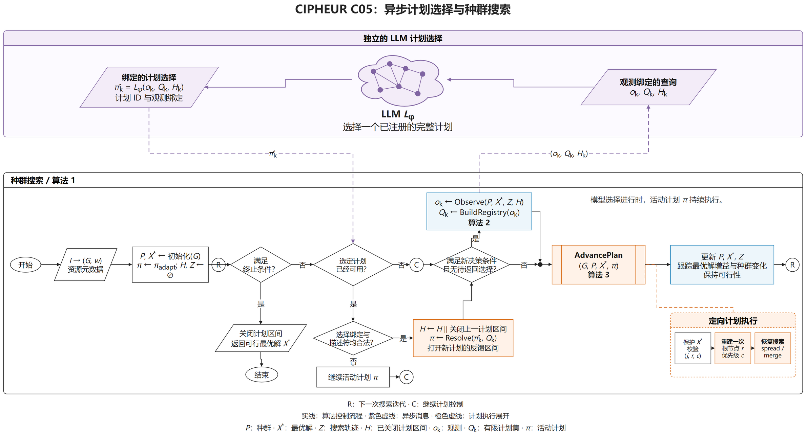

# AAMAS · CIPHEUR C05

当前为 **non-llm-controls** 分支，选择器定义与运行命令见 [分支说明](docs/CONTROLS.md)。

[English](README.md) · [问题模型与符号](docs/MODEL_AND_PSEUDOCODE.md) · [LaTeX 伪代码](docs/c05_model_algorithm.tex) · [PDF](docs/c05_model_algorithm.pdf) · [算法细节](docs/ALGORITHM.md) · [结果与实验参数](docs/RESULTS.md)

本仓库整理 CIPHEUR v0.6.0 的 C05：四解种群的持续原生搜索，以及根据搜索证据异步选择有限结构计划的 LLM 控制层。目标为总接触时长，内部使用整数 ticks。

## 分支

| 分支 | 内容 |
|---|---|
| [main](https://github.com/Mister-Ryder/AAMAS-CIPHEUR-C05/tree/main) | C05-LLM 运行入口、原生搜索、八视图输入图、LLM 逐次结果、数值汇总、算法文档及流程图 |
| [non-llm-controls](https://github.com/Mister-Ryder/AAMAS-CIPHEUR-C05/tree/non-llm-controls) | 包含主分支内容，并增加 KNN、LinUCB、bandit、rule、static 选择器、原实验中的 adaptive 基线模式和经典 WMIS 对照实验及详细结果 |

主分支保留 LLM 执行路径需要的共享特征构造与区间更新记录。额外分支开放各类非 LLM 计划选择入口。

## 算法流程



[可编辑 draw.io](docs/figures/c05-flowchart-zh.drawio) · [PDF](docs/figures/c05-flowchart-zh.drawio.pdf) · [英文图与 PDF](docs/figures/)

- **持续搜索状态**：维护四个可行解、历史最优解、轨迹重叠与增益信息。
- **状态证据**：提取停滞、不同时间窗口的增益、目标槽位的阻塞接触、资源与时间关系、已完成计划的区间记录。
- **有限计划表**：九种单操作计划，以及绑定真实槽位、锚点接触和资源优先级模板的定向计划。
- **异步选择**：LLM 返回当前表中的确切计划 ID；模型请求期间原生搜索继续运行。
- **校验与安装**：核对快照、计划身份和有效期；进入原生干预前再次检查受保护槽位。
- **定向重建与恢复**：选择定向计划时，在进入阶段时对目标轨迹重建一次并继续搜索，随后通过 spread 或 merge 恢复搜索，末步骤持续至下次安装。
- **区间记录**：记录计划安装至替换或结束之间的最优值增益、种群增益和耗时，供后续决策读取。

各组件的源码对应、优先级表达式、输入输出和时序见 [ALGORITHM.md](docs/ALGORITHM.md)。

## 360 秒实验结果汇总

CP-SCALE-AU-L002 八视图，每视图五个种子 `67、71、73、79、83`，每种选择器 40 次运行。每次 360 秒、种群 4、一个原生线程；历史批次同时运行 16 个独立任务。

平均值的计算顺序为：每个视图先对五个种子取平均，再对八个视图等权平均。单位为接触秒，`value_ticks / 1,000,000`。

| 选择器 | 平均接触秒 |
|---|---:|
| LLM — DeepSeek Flash | 1,137,361.735189 |
| KNN | 1,137,632.198938 |
| LinUCB | 1,137,512.893283 |
| Bandit | 1,137,219.802194 |
| Rule | 1,137,174.044553 |
| Static | 1,137,128.217217 |
| Adaptive | 1,133,859.369542 |

逐视图结果、运行明细、数据哈希和原实验参数见 [RESULTS.md](docs/RESULTS.md)。

## 900 秒注册实验（2026 年 10 月 9 日）

[900 秒实验资料](experiments/900s-20261009/README.md)使用 CP-SCALE-AU-L002 的相同八视图，每视图五个种子。每次求解保持四解种群、一个原生求解线程。C05-Codex 通过独立的 `gpt-6-luna` 中继在冻结的有限计划表中选择计划，选择次数上限扩展为 21。四种方法共 160 条预注册位置，均通过输入图、目标值、可行性和身份的独立核验。

[Codex 结果](experiments/900s-20261009/results/)包含 40 条求解位置；本分支另有[对照方法的 120 条数值记录](experiments/900s-20261009/controls/results/positions.csv)、[逐视图均值](experiments/900s-20261009/controls/results/by_view.csv)和[同视图同种子的配对差值](experiments/900s-20261009/controls/results/paired_deltas.csv)。八视图等权最终均值如下，单位为接触秒：

| 方法 | 位置数 | 平均接触秒 |
|---|---:|---:|
| C05-Codex（`gpt-6-luna`） | 40 | 1,138,760.36872255 |
| C05-KNN | 40 | 1,138,451.911341275 |
| C05-LinUCB | 40 | 1,138,417.6763745 |
| CHILS-p4-custom（`search_step=10`） | 40 | 1,134,942.785685025 |

Codex 组共 840 次模型调用，其中 838 次产生有效计划提案。[Codex 审计凭据](experiments/900s-20261009/results/audit_public.json)和[对照组审计凭据](experiments/900s-20261009/controls/results/audit_public.json)记录私有审计及原始结果的 SHA256。

## 经典 WMIS 对照（900 秒）

[经典方法实验资料](experiments/900s-20261009/classical_wmis/README.md)使用相同八视图和精确整数目标值，每个求解位置绑定一个物理 CPU，外层求解上限为 900 秒。[技术结果](experiments/900s-20261009/classical_wmis/RESULTS.md)列出逐视图数值、实际用时、资源设置和失败记录；[搜索过程图](experiments/900s-20261009/classical_wmis/results/figures/manifest_public.json)使用保存的实际改进事件。

| 方法 | 有效位置 | 八视图等权平均接触秒 |
|---|---:|---:|
| 模拟退火 | 40/40 | 1,143,916.7904964 |
| C05-Codex | 40/40 | 1,138,760.36872255 |
| C05-KNN | 40/40 | 1,138,451.911341275 |
| C05-LinUCB | 40/40 | 1,138,417.6763745 |
| CHILS-p4-custom | 40/40 | 1,134,942.785685025 |
| StableSolver 局部搜索，独立 9 GiB／内部 850 秒 | 8/8 | 1,131,091.0165975 |
| StableSolver 大邻域搜索 | 8/8 | 1,125,961.321395625 |
| GRASP | 40/40 | 1,068,698.2984871 |
| StableSolver 局部搜索，3 GiB 上限 | 0/8 | — |

补充的 StableSolver 单遍 greedy-gwmin 在八视图上的均值为 991,618.934985 接触秒，平均实际停止时间为 1.823 秒。局部搜索主批次 3 GiB 组和独立 6 GiB 补测均为 0/8 个有效最终分数，失败收据保留且不赋予分数。9 GiB 结果是另一组独立通过 8/8 审计的补测，其内部上限为 850 秒、外层仍为 900 秒；资源条件与逐视图数值见经典方法实验资料。

## 运行

使用 Linux 或 WSL，Python 3.10 及以上版本、GCC/G++ 和 OpenMP。在仓库目录中执行：

```bash
python -m pip install -e .
python scripts/build_native.py
```

在环境变量中设置 `CIPHEUR_API_KEY`。默认模型为 `deepseek-flash`，端点为 `https://api.deepseek.com/chat/completions`；可通过 `CIPHEUR_MODEL`、`CIPHEUR_ENDPOINT` 配置。

```bash
python -m cipheur_c05 data/CP-SCALE-AU-L002/g0340.npz \
  --out run_outputs/g0340_llm_seed67.json --seed 67 --seconds 360 \
  --graph-id CP-SCALE-AU-L002__g0340
```

输出文件名需未被使用。完整八视图输入位于 `data/CP-SCALE-AU-L002/`。首次模型请求机会在第 20 秒，后续间隔 40 秒；实际提交要求请求线程空闲且剩余时间超过 47 秒。最多 8 次请求，HTTP 超时 45 秒，返回有效期 60 秒。原实验模型参数为 thinking enabled、reasoning effort low、最大输出 8,192 tokens。

`python scripts/smoke_check.py` 可执行无需模型接口的离线运行检查。其他选择器的命令与定义见 [`non-llm-controls` 分支说明](https://github.com/Mister-Ryder/AAMAS-CIPHEUR-C05/blob/non-llm-controls/docs/CONTROLS.md)。
